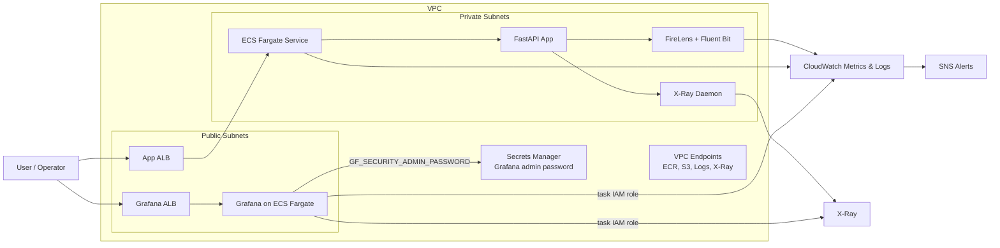

# AWS Enterprise Observability Platform with Terraform, CloudWatch, ECS Fargate & Self-Hosted Grafana

This project provisions a production-ready observability platform on AWS using Terraform, ECS Fargate, AWS X-Ray, Amazon CloudWatch (Logs + Metrics), SNS, and self-hosted open-source Grafana running in its own Fargate task. Grafana, the FastAPI sample app, FireLens, and the X-Ray daemon are all built from local Dockerfiles and pushed to private ECR repositories. Datasources and dashboards are baked into the Grafana image with file-based provisioning, so a single `terraform apply` produces a working Grafana URL with live telemetry.

## Project Structure

```text
.
├── .gitignore
├── .env.example
├── .github
│   └── workflows
│       └── ci.yml
├── .terraform.lock.hcl
├── README.md
├── LICENSE
├── app
│   ├── .dockerignore
│   ├── Dockerfile
│   ├── logging_config.py
│   ├── main.py
│   └── requirements.txt
├── firelens
│   ├── Dockerfile
│   └── fluent-bit.conf
├── grafana
│   ├── .dockerignore
│   ├── Dockerfile
│   ├── entrypoint.sh
│   ├── dashboards.tmpl
│   │   ├── logs.json
│   │   ├── metrics.json
│   │   ├── sla-overview.json
│   │   └── traces.json
│   └── provisioning
│       ├── dashboards
│       │   └── dashboards.yaml
│       └── datasources
│           └── datasources.yaml
├── main.tf
├── modules
│   ├── ecr-build
│   ├── ecs-fargate-app
│   ├── grafana
│   └── networking
├── outputs.tf
├── providers.tf
├── scripts
│   ├── bootstrap-config.sh
│   ├── deploy.sh
│   └── destroy.sh
├── terraform.tfvars.example
├── variables.tf
└── xray
    └── Dockerfile
```

## Architecture



## Technologies

- Terraform `~> 1.14`
- AWS provider `~> 6.40`
- ECS Fargate (application + Grafana)
- Application Load Balancer (one per service)
- AWS FireLens + Fluent Bit (CloudWatch Logs output)
- AWS X-Ray
- Amazon CloudWatch Logs + Metrics + Alarms
- Amazon SNS
- Self-hosted Grafana (`grafana/grafana:11.3.0`) with file-based provisioning and `grafana-x-ray-datasource` plugin
- AWS Secrets Manager (Grafana admin password, application signing key)
- Amazon ECR (private repos, image scanning, immutable tags)
- GitHub Actions
- FastAPI + Python 3.12

## Design Notes

- The application service runs in private subnets with no NAT gateway. Interface and gateway VPC endpoints keep image pulls and telemetry traffic private and low-cost.
- FireLens (Fluent Bit) ships application logs to CloudWatch Logs. Grafana queries those logs via its CloudWatch Logs Insights datasource — no separate log store to operate.
- The OSS Grafana container runs on its own ECS Fargate service behind a dedicated public ALB. CloudWatch and X-Ray datasources authenticate using the ECS task IAM role — no static keys anywhere. The admin password is generated by Terraform, stored in AWS Secrets Manager, and injected at task start as `GF_SECURITY_ADMIN_PASSWORD` via the ECS `secrets` field.
- Datasources and dashboards are baked into the Grafana image. Datasources live in `grafana/provisioning/datasources/datasources.yaml` and use Grafana's native env-var substitution (`${AWS_REGION}`, `${APP_LOG_GROUP}`). Dashboards live in `grafana/dashboards.tmpl/` as templated JSON; the container entrypoint renders cluster name, service name, and ALB ARN suffixes into `/var/lib/grafana/dashboards/` before exec'ing Grafana, so panels resolve without any post-deploy clicks.
- CloudWatch Logs are encrypted at rest with the AWS-managed KMS key by default; Grafana keeps a customer-managed KMS key for its own log group.
- HTTPS is available on the application ALB when you attach an ACM certificate via `alb_certificate_arn`, without any architectural changes. The Grafana ALB is HTTP-only by default to keep the deliverable single-command; front it with CloudFront or attach a certificate if you need HTTPS.

## Deployment

### Prerequisites

- AWS CLI configured for the target account (Terraform verifies the active caller account against `aws_account_id`)
- Docker Desktop / engine running, with Buildx enabled
- Terraform `1.14.8` or another `1.14.x` release
- `jq` on PATH (the deploy/destroy scripts use it to parse the Secrets Manager config blob)
- IAM permissions to create VPC, ECS, ECR, CloudWatch, SNS, IAM, KMS, and Secrets Manager resources

### One-command deploy

1. Copy the env template and fill in your values:

   ```bash
   cp .env.example .env
   # edit .env: set TF_VAR_aws_profile, TF_VAR_aws_account_id, TF_VAR_alarm_email,
   #           TF_VAR_owner, TF_VAR_cost_center
   ```

   `.env` is gitignored. Nothing personal or account-identifying lives in source control.

2. Seed the deploy-time config secret in AWS Secrets Manager (one-time, ~$0.40/month):

   ```bash
   ./scripts/bootstrap-config.sh
   ```

   Account ID, alarm email, owner, and cost center are written into a single
   secret (`obs-platform/deploy-config` by default — override with
   `OBS_CONFIG_SECRET_NAME`). After this, you can trim those four lines out of
   `.env` — `deploy.sh` and `destroy.sh` fetch them from Secrets Manager every run.

3. Deploy:

   ```bash
   ./scripts/deploy.sh
   ```

   The script fetches the config from Secrets Manager, verifies your AWS credentials match the configured account, checks Docker is reachable, runs `terraform init` and `terraform apply`, and prints the Grafana URL plus the AWS CLI command for retrieving the admin password.

4. Open the Grafana URL printed at the end:

   ```text
   Grafana:        http://<grafana-alb-dns>
   Login user:     admin
   Get password:   aws secretsmanager get-secret-value --region us-east-1 --secret-id <secret-name> --query SecretString --output text
   ```

   The `AWS Enterprise Observability Platform` folder is preloaded with four dashboards: `Application Logs`, `Platform Metrics`, `X-Ray Traces`, `SLA Overview`.

5. Generate traffic so panels light up:

   ```bash
   APP_URL=$(terraform output -raw application_url)
   curl "${APP_URL}/health"
   curl "${APP_URL}/orders/42"
   curl -X POST "${APP_URL}/orders"
   curl "${APP_URL}/fail"
   ```

6. Confirm the SNS email subscription that AWS sends to `TF_VAR_alarm_email`.

### Manual workflow

If you prefer to run Terraform directly:

```bash
set -a && source .env && set +a
terraform init
terraform apply
terraform output
```

Terraform reads any `TF_VAR_<name>` env var as input for variable `<name>`, so no `terraform.tfvars` file is needed. If you prefer Terraform variable files, copy `terraform.tfvars.example` to `terraform.tfvars` instead.

### Teardown

```bash
./scripts/destroy.sh
```

If your ECR repositories still hold images (the default), set `TF_VAR_ecr_force_delete=true` in `.env` before running so Terraform can remove them.

## Outputs

| Output | Description |
| --- | --- |
| `application_url` | Public ALB URL serving the FastAPI sample app. |
| `grafana_url` | Public ALB URL serving the self-hosted Grafana workspace. |
| `grafana_admin_secret_name` | Secrets Manager secret holding the Grafana admin password. |
| `alarm_sns_topic_arn` | SNS topic targeted by all CloudWatch alarms. |
| `ecr_repositories` | Map of private ECR repository URLs (app, firelens, xray, grafana). |

## Continuous Integration

A GitHub Actions workflow at `.github/workflows/ci.yml` runs on every push and pull request. It checks Terraform formatting, runs `terraform validate`, compiles the Python app, syntax-checks the Grafana entrypoint and the bootstrap/deploy/destroy scripts, validates the Grafana provisioning YAML, and validates each dashboard JSON template.

## Reusing This Platform

- Replace the FastAPI image with a team-specific service image while keeping the same ECS, FireLens, CloudWatch, X-Ray, and Grafana plumbing.
- Reuse the networking module to standardize private subnet, endpoint, and low-cost no-NAT patterns across environments.
- Point additional services at the same CloudWatch log groups, or clone the FireLens config to create team-specific log groups with tighter retention.
- Add team-specific dashboards by dropping new JSON files into `grafana/dashboards.tmpl/` — the entrypoint will render and Grafana will pick them up on the next image build.
- Scale up for production by raising ECS autoscaling ceilings, enabling multi-AZ ALBs, attaching an ACM certificate to the ALB, extending CloudWatch log retention, and layering in CI/CD and policy checks.

## License

Released under the [MIT License](LICENSE).
