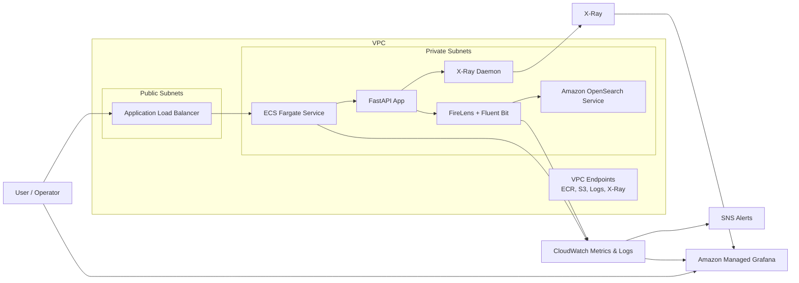

# AWS Enterprise Observability Platform with Terraform, Amazon OpenSearch (ELK) & ECS Fargate

This project provisions a production-ready observability platform on AWS using Terraform, ECS Fargate, Amazon OpenSearch Service, AWS X-Ray, CloudWatch, SNS, and Amazon Managed Grafana. It covers secure cloud design, reusable Infrastructure as Code, end-to-end telemetry integration, proactive alerting, and operational automation. The stack includes optional HTTPS on the ALB, customer-managed KMS keys for CloudWatch Logs, OpenSearch, and Grafana, ECS autoscaling, and OpenSearch health alarms.

## Project Structure

```text
.
├── .gitignore
├── .env.example
├── .github
│   └── workflows
│       └── ci.yml
├── .terraform.lock.hcl
├── README.md
├── app
│   ├── .dockerignore
│   ├── Dockerfile
│   ├── logging_config.py
│   ├── main.py
│   └── requirements.txt
├── firelens
│   ├── Dockerfile
│   └── fluent-bit.conf
├── main.tf
├── modules
│   ├── ecr-build
│   │   ├── main.tf
│   │   ├── outputs.tf
│   │   └── variables.tf
│   ├── ecs-fargate-app
│   │   ├── main.tf
│   │   ├── outputs.tf
│   │   └── variables.tf
│   ├── grafana
│   │   ├── main.tf
│   │   ├── outputs.tf
│   │   ├── scripts
│   │   │   └── provision_grafana.sh
│   │   ├── templates
│   │   │   ├── dashboards
│   │   │   │   ├── logs.json
│   │   │   │   ├── metrics.json
│   │   │   │   ├── sla-overview.json
│   │   │   │   └── traces.json
│   │   │   └── datasources
│   │   │       ├── cloudwatch.json
│   │   │       └── xray.json
│   │   └── variables.tf
│   ├── networking
│   │   ├── main.tf
│   │   ├── outputs.tf
│   │   └── variables.tf
│   └── opensearch
│       ├── main.tf
│       ├── outputs.tf
│       └── variables.tf
├── outputs.tf
├── providers.tf
├── terraform.tfvars.example
├── variables.tf
└── xray
    └── Dockerfile
```

## Architecture



## Technologies

- Terraform `~> 1.14`
- AWS provider `~> 6.40`
- ECS Fargate
- Application Load Balancer
- Amazon OpenSearch Service
- AWS FireLens + Fluent Bit
- AWS X-Ray
- Amazon CloudWatch + CloudWatch Alarms
- Amazon SNS
- Amazon Managed Grafana
- Amazon ECR
- GitHub Actions
- FastAPI + Python 3.12

## Design Notes

- The ECS service and OpenSearch domain run in private subnets with no NAT gateway. Interface and gateway VPC endpoints keep image pulls and telemetry traffic private and low-cost.
- FireLens fans application logs out to both Amazon OpenSearch Service and CloudWatch Logs. This keeps OpenSearch as the managed ELK backend while letting Managed Grafana use CloudWatch Logs and CloudWatch Metrics natively.
- Runtime configuration is passed to the ECS task through environment variables. The task definition supports the ECS `secrets` field for pulling runtime secrets from AWS Secrets Manager or SSM Parameter Store when a service needs them.
- The stack is hardened for production with customer-managed KMS keys for CloudWatch Logs, OpenSearch, and Grafana, OpenSearch health alarms, ECS service autoscaling, and an optional HTTPS path on the ALB.
- The default OpenSearch footprint stays compact, but the module exposes the knobs needed to raise instance count, enable dedicated masters, and keep the data plane private across multiple Availability Zones.
- Grafana dashboards are provisioned through the Grafana HTTP API from Terraform because the workspace URL and API key do not exist until the workspace is created. This preserves a one-command `terraform apply` experience.

## Deployment

### Prerequisites

- AWS CLI configured for the target account (Terraform verifies the active caller account against `aws_account_id`)
- Docker with Buildx enabled
- Terraform `1.14.8` or another `1.14.x` release
- IAM permissions to create VPC, ECS, ECR, CloudWatch, SNS, OpenSearch, and Managed Grafana resources
- If you want immediate human access to Grafana, IAM Identity Center user IDs or group IDs ready for `grafana_admin_user_ids` or `grafana_admin_group_ids`

### Step-by-Step

1. Copy the env template and fill in your values:

   ```bash
   cp .env.example .env
   # edit .env: set TF_VAR_aws_account_id, TF_VAR_aws_profile, TF_VAR_alarm_email,
   # TF_VAR_owner, TF_VAR_cost_center, and any optional overrides
   ```

   `.env` is gitignored. Nothing personal or account-identifying lives in source control.

   If you prefer Terraform variable files, copy `terraform.tfvars.example` to `terraform.tfvars` and edit that file instead.

2. Export the env vars and apply:

   ```bash
   set -a && source .env && set +a
   terraform init
   terraform apply
   ```

   Terraform reads any `TF_VAR_<name>` env var as input for variable `<name>`,
   so no `terraform.tfvars` file is needed.

3. Optional — grant Grafana admin access to specific IAM Identity Center
   principals before apply:

   ```bash
   export TF_VAR_grafana_admin_user_ids='["user-id-1"]'
   export TF_VAR_grafana_admin_group_ids='["group-id-1"]'
   ```

4. Confirm the SNS email subscription that AWS sends to `TF_VAR_alarm_email`.

5. After the apply completes, capture the outputs:

   ```bash
   terraform output
   ```

6. Generate traffic and test the telemetry pipeline:

   ```bash
   APP_URL=$(terraform output -raw application_url)
   curl "${APP_URL}/health"
   curl "${APP_URL}/orders/42"
   curl -X POST "${APP_URL}/orders"
   curl "${APP_URL}/fail"
   ```

7. Open the Grafana workspace URL from the Terraform outputs and validate:

   - `Application Logs`
   - `Platform Metrics`
   - `X-Ray Traces`
   - `SLA Overview`

### Post-Deploy Validation Checklist

- ALB serves the FastAPI application successfully
- ECS service reaches the desired count
- OpenSearch domain status is green and receives `ecs-observability` documents
- CloudWatch log group `/aws/<project>/application` contains structured JSON events
- X-Ray traces appear for `/orders` and `/fail`
- SNS alarm topic is confirmed
- Managed Grafana contains the prebuilt folder and dashboards

## Platform Benefits

- End-to-end telemetry is automated: a new ECS deployment is visible in logs, metrics, traces, and alerting without manual console steps.
- Structured logs are indexed in OpenSearch and duplicated to CloudWatch Logs for native AWS alerting and Grafana exploration.
- The application path is multi-AZ and alarm-driven, with proactive coverage for unhealthy targets, elevated CPU, 5xx responses, and log-derived error spikes.
- Long-lived observability data is encrypted with customer-managed KMS keys.
- HTTPS is available on the ALB when you attach an ACM certificate, without any architectural changes.
- The platform avoids NAT gateway cost by using VPC endpoints for ECR, S3, CloudWatch Logs, and X-Ray.
- The repo is modular and reusable, which makes it easy to onboard another service by reusing networking, OpenSearch, Grafana, and ECS patterns.

## How Other Teams Can Reuse This Platform

- Replace the FastAPI image with a team-specific service image while keeping the same ECS, FireLens, CloudWatch, and X-Ray plumbing.
- Reuse the networking module to standardize private subnet, endpoint, and low-cost no-NAT patterns across environments.
- Point additional services at the same OpenSearch domain or clone the module to create domain-per-team isolation.
- Extend the Grafana templates with team-specific KPIs while preserving common SRE dashboards such as SLA, error budget, request volume, and trace visibility.
- Scale up for production by increasing OpenSearch node count, enabling multi-AZ domain design, attaching an ACM certificate to the ALB, and layering in CI/CD and policy checks.

## Continuous Integration

A GitHub Actions workflow at `.github/workflows/ci.yml` runs on every push and pull request. It checks Terraform formatting, runs `terraform validate`, compiles the Python app, syntax-checks the Grafana bootstrap script, and validates the dashboard and datasource JSON templates.

## License

Released under the [MIT License](LICENSE).
